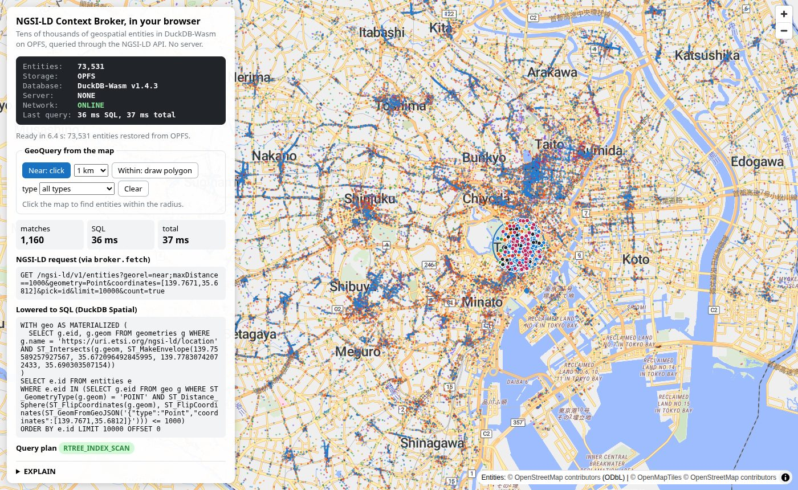

# poc-duckdb-wasm-ngsi-ld

An NGSI-LD Context Broker with tens of thousands of geospatial entities,
persistent storage, spatial indexing and GeoQuery, running entirely inside
your browser, even offline.

Demo: https://yuiseki.github.io/poc-duckdb-wasm-ngsi-ld/



- 73,531 NGSI-LD entities: shops, restaurants, stations, clinics, schools,
  public facilities and more in Tokyo's 23 wards, from OpenStreetMap.
- Stored in DuckDB-Wasm, in a `.duckdb` file in the browser's Origin
  Private File System (OPFS). It survives reloads and browser restarts.
- Queried through the NGSI-LD API: `broker.fetch(Request)` returns a
  `Response`. There is no server, no Docker and no external database; the
  site is static files.
- GeoQueries are lowered to SQL for DuckDB Spatial and answered through an
  R-tree index: a 1 km `near` around Tokyo Station matches 1,160 entities in
  about 20 to 30 ms.
- After one visit it works offline: a Service Worker keeps the page,
  DuckDB-Wasm and its extensions, and OPFS keeps the data. Close the
  browser, turn the network off, open the page again, and the same
  GeoQueries answer.

This is a proof of concept, not a conformant NGSI-LD implementation. It has
been tested with Chromium only.

## Try it

1. Open the demo. The first visit downloads a 16.7 MB seed database and
   copies it into OPFS; the status panel then shows `Entities: 73,531`,
   `Storage: OPFS`, `Database: DuckDB-Wasm`, `Server: NONE`.
2. Click the map. The page issues
   `GET /ngsi-ld/v1/entities?georel=near;maxDistance==1000&geometry=Point&coordinates=[lon,lat]`
   through `broker.fetch`, and shows the request, the SQL it was lowered to,
   the number of matches, the time, and DuckDB's query plan with
   `RTREE_INDEX_SCAN`.
3. Switch to "Within: draw polygon", click the vertices and press Enter (or
   double-click) for a `georel=within` query. The type filter adds `type=`.
4. Reload, or close the browser and open the page again: the database comes
   back from OPFS (`restored from OPFS`) and the same queries give the same
   answers.
5. Go offline (DevTools, Network, Offline, or turn the network off), close
   the browser, open the page again: `Network: OFFLINE`, and the queries
   still answer. The basemap shows only the tiles you looked at while
   online; the entities, the ward outline and the queries do not need it.
6. "Advanced / Debug" has a request console for any NGSI-LD call (POST,
   GET, DELETE), a button to download the `.duckdb` file, and one to
   delete it.

From the devtools console:

```js
const broker = await window.broker;
const res = await broker.fetch(new Request(location.origin +
  '/ngsi-ld/v1/entities?type=Station&georel=near;maxDistance==500&geometry=Point&coordinates=[139.7671,35.6812]'));
await res.json();
```

## Measurements

Median of five runs of `broker.fetch` in the page, around Tokyo Station, with
`pick=id&count=true` as the map sends it. AMD Ryzen 9 5950X, Chromium 145 on
Linux with the GPU enabled, database restored from OPFS.

| Query | Matches | SQL |
| --- | --- | --- |
| `within` a triangle around the Imperial Palace | 24 | 5 ms |
| `near;maxDistance==500` | 384 | 11 ms |
| `near;maxDistance==1000` | 1,160 | 22 ms |
| `near;maxDistance==1000` and `type=Restaurant` | 609 | 33 ms |
| `near;maxDistance==2000` | 5,153 | 73 ms |

The time grows with the number of candidates the index returns, not with
the size of the table (see Architecture). These are wall-clock times on the
page's main thread, so anything else that holds the main thread is counted
too: with software WebGL (headless Chromium's default, SwiftShader) every
map repaint takes about 90 ms and a 1 km click measures 100 to 300 ms.

From a local server, first load (copying the seed into OPFS) takes 8 to 11 s
and a restore from OPFS 4 to 5 s, most of it loading the entities onto the
map; on the demo site, add the download of the seed.

## Run

```sh
npm install
npm run setup        # public/duckdb-extensions and public/seed (downloads; see Data)
npm run dev          # http://localhost:5173
npm run build        # static files in dist/, serve them with any static host
npm run preview      # serve dist/ locally
```

Query parameters for development: `?seed=none` starts from an empty
database, `?seed=ndjson` ignores the seed database and imports the NDJSON
through the batch API (about 40 s).

### Tests

```sh
npm test             # unit tests (vitest, Node): JSON-LD and SQL lowering
npm run test:e2e     # end-to-end (Playwright, Chromium) against the production build
```

`tests/e2e/demo.spec.ts` is the demo scenario: first load imports the seed,
a click issues a `near` query and a drawn polygon a `within` query, both
answered through `RTREE_INDEX_SCAN` and highlighted on the map; then a
reload and a browser relaunch on the same profile restore the database
from OPFS, give the same answer, and still accept a POST. A second test
relaunches the browser with the network off after one online visit and
runs the same query.
`tests/e2e/broker.spec.ts` covers the API on an empty database. Both need
`npm run setup` first and a Playwright Chromium (`npx playwright install
chromium`).

`npm run smoke -- <url>` checks a deployed copy. GitHub Actions builds the
seed, runs the unit and end-to-end tests on every push, and deploys `dist/`
to GitHub Pages from `main`.

## API

The broker is not an HTTP server. It is a Fetch-API-shaped function:

```ts
broker.fetch(request: Request): Promise<Response>
```

| Method | Path | Notes |
| --- | --- | --- |
| `POST` | `/ngsi-ld/v1/entities` | `application/json` (context from the `Link` header, else core) or `application/ld+json` (`@context` in the body). `201` + `Location`, `409` if the id exists. |
| `POST` | `/ngsi-ld/v1/entityOperations/create` | A JSON array of entities. `201` with the ids, or `207` with `{success, errors}` when some already exist or are invalid. |
| `GET` | `/ngsi-ld/v1/entities/{id}` | Normalized representation. `404` if missing. |
| `GET` | `/ngsi-ld/v1/entities?type=...` | Comma-separated types are OR-ed. `limit` (default 20, max 100,000), `offset`, `count=true` (`NGSILD-Results-Count`), `pick` (`pick=id` returns ids without loading documents). |
| `GET` | `/ngsi-ld/v1/entities?georel=...&geometry=...&coordinates=...` | Optional `geoproperty` (default `location`). Combines with `type` by AND. |
| `DELETE` | `/ngsi-ld/v1/entities/{id}` | Added for the demo and tests. |

Responses are `application/json` with a `Link` header to the context,
`application/ld+json` with `@context` in the body, or
`application/geo+json` (a FeatureCollection) according to `Accept`. Errors
are NGSI-LD ProblemDetails (`BadRequestData`, `AlreadyExists`,
`ResourceNotFound`, ...).

Supported `georel`: `near;maxDistance==<m>`, `near;minDistance==<m>`,
`within`, `contains`, `intersects`, `disjoint`, `equals`, `overlaps`.
Supported `geometry`: `Point`, `MultiPoint`, `LineString`,
`MultiLineString`, `Polygon`, `MultiPolygon`. Supported attribute types:
`Property`, `Relationship`, `GeoProperty`, including multi-attributes
distinguished by `datasetId`.

Query responses also carry what the demo visualises, in headers so the body
stays NGSI-LD: `X-Lowered-SQL` (the SQL with parameters inlined,
percent-encoded), `Server-Timing` (`sql`, `count` and `total` durations),
and, when the request has `X-Explain: 1`, `X-Query-Plan` (DuckDB's EXPLAIN,
percent-encoded). The page never sends SQL to DuckDB itself.

## Architecture

```
 page (main thread)                                     dedicated Worker
 ┌────────────────────────────────────────────────┐    ┌─────────────────────────┐
 │ map (MapLibre) ── clicks, polygons             │    │ DuckDB-Wasm 1.4.3       │
 │        │ Request                               │    │  + spatial (R-tree)     │
 │ broker.fetch(Request) ── src/broker.ts         │    │                         │
 │        ├─ src/ngsi.ts   jsonld.expand/compact  │SQL │ opfs://ngsi-ld-tokyo23- │
 │        ├─ src/lower.ts  NGSI-LD query -> SQL ──┼───▶│   v2.duckdb             │
 │        └─ src/store.ts  canonical tables ──────┼───▶│ (sync access handle)    │
 └────────────────────────────────────────────────┘    └─────────────────────────┘
```

JSON-LD. Expansion and compaction are done by the
[`jsonld`](https://github.com/digitalbazaar/jsonld.js) library. The
NGSI-LD core context v1.8 is bundled (`src/contexts/`) and served by a
custom document loader; other remote contexts are fetched and cached. The
user context is placed before the core context so the protected core terms
always win.

Canonical tables. An entity is expanded and walked into rows keyed by
expanded IRIs, so `Building` under two different contexts is two different
types:

```sql
entities     (id PRIMARY KEY, eid INTEGER,          -- eid: compact key for geometries
              created_at, modified_at,
              doc JSON)                             -- compacted with the core context
entity_types (entity_id, type)                      -- expanded IRI, one row per type
attributes   (entity_id, name, dataset_id,          -- name: expanded IRI
              attr_type,                            -- Property | Relationship | GeoProperty
              value JSON, object VARCHAR,
              instance JSON)                        -- whole expanded attribute instance
geometries   (eid, name, geom GEOMETRY)             -- one row per GeoProperty, RTREE index
```

`instance` keeps the expanded attribute, so a GET with another context
rebuilds the expanded entity and compacts it again; the result equals the
POSTed body. With the core context, the common case, `doc` (compacted once
at write time) is returned as is.

Query lowering. `lower.ts` turns query parameters into parameterised SQL. A
1 km `near` becomes:

```sql
WITH geo AS MATERIALIZED (
  SELECT g.eid, g.geom FROM geometries g
  WHERE g.name = ? AND ST_Intersects(g.geom, ST_MakeEnvelope(?, ?, ?, ?))
)
SELECT e.id FROM entities e
WHERE e.eid IN (SELECT g.eid FROM geo g WHERE ST_GeometryType(g.geom) = 'POINT'
  AND ST_Distance_Sphere(ST_FlipCoordinates(g.geom), ST_FlipCoordinates(ST_GeomFromGeoJSON(?))) <= ?)
ORDER BY e.id LIMIT ? OFFSET ?
```

Three things about that shape were found by reading EXPLAIN in the browser:

- DuckDB rewrites a spatial predicate into `RTREE_INDEX_SCAN` only when the
  filter sits directly on the table scan. A correlated `EXISTS` (the first
  version of this code) is decorrelated into a hash join over a sequential
  scan, so the predicate runs in its own `MATERIALIZED` CTE.
- `ST_Distance_Sphere` is not an indexable predicate, and putting it in the
  same filter also brings back the sequential scan. `near` therefore uses
  the index for the bounding box of the circle (computed in `lower.ts`) and
  applies the exact distance outside the CTE.
- `ST_Distance_Sphere` assumes `[lat, lon]` axis order while GeoJSON is
  `[lon, lat]`; without `ST_FlipCoordinates`, Tokyo to Shinjuku Station
  comes out as 7.49 km instead of 6.13 km.

Every row an R-tree lookup returns is then fetched from the table one at a
time, and in DuckDB-Wasm that fetch, not the tree walk, dominates: about
0.05 ms per candidate from a wide table. `geometries` is kept narrow and
keyed by an integer for that reason, which halves it. It is also why a
2 km query is slower than a 1 km one, and why for very large areas a plain
scan would beat the index.

Seed. `scripts/build-entities.mjs` turns the OpenStreetMap points into
NGSI-LD entities (NDJSON, in Hilbert order). `scripts/build-seed-db.mjs`
opens the app in headless Chromium with `?seed=ndjson`, which imports them
through `POST /ngsi-ld/v1/entityOperations/create`, and saves the OPFS file
through the page's "Download .duckdb" button. The seed is therefore written
by the same DuckDB-Wasm build and the same NGSI-LD code path that read it.
On first load the page streams the gzipped file into OPFS before opening
it.

Persistence. Each write runs in a transaction followed by `CHECKPOINT`, so
the OPFS `.duckdb` file is self-contained after every request. The file
name carries a schema version; files of older versions are deleted.

Offline. `scripts/fetch-extensions.mjs` puts the DuckDB spatial and json
extensions (pinned by sha256) under `duckdb-extensions/`, and the page
points `custom_extension_repository` there, so nothing is fetched from
`extensions.duckdb.org`. The Service Worker (`sw/sw.js`; the build writes
the list of files into it) precaches the page, DuckDB-Wasm, its worker,
the extensions and the ward outline, about 61 MB, and caches basemap
requests as they happen. Navigation is network-first so a new deploy shows
up; everything else is served from the cache.

The broker itself does not run in the Service Worker: DuckDB-Wasm needs a
dedicated Worker and OPFS sync access handles are only available in
dedicated Workers, neither of which a Service Worker can create. Because
the API is `Request -> Response`, a Service Worker could still expose it
at real URLs by relaying requests to a page that owns the broker. This
relay is not implemented.

## Data

The entities come from
[osm-tokyo23-src-2026-08](https://huggingface.co/datasets/yuiseki/osm-tokyo23-src-2026-08),
a frozen OpenStreetMap extract of Tokyo's 23 wards taken from the planet
file of 2026-08-31 (`planet_osm_point`, checked by md5). Named points with
`amenity`, `shop`, `tourism` or `railway=station` tags are kept, plus
emergency facilities (assembly points, defibrillators, shelters), clipped
to the wards with the boundary from the same snapshot. Each becomes one
entity with `name`, `category` (the OSM tag value), `source` (the OSM URL)
and `location`:

| Type | Entities |
| --- | --- |
| Restaurant | 27,605 |
| Shop | 27,142 |
| HealthcareFacility | 6,613 |
| PublicFacility | 4,809 |
| EducationFacility | 2,936 |
| PlaceOfWorship | 2,004 |
| TouristAttraction | 1,335 |
| Station | 622 |
| EmergencyFacility | 465 |

OpenStreetMap has few evacuation sites for Tokyo (24 assembly points), so
official evacuation-site data is not represented.

The basemap is the osm-liberty style from `tile.yuiseki.net`, fetched
online; without it the page falls back to a plain background with the ward
outline.

## Constraints

- duckdb-wasm is pinned to 1.32.0 (DuckDB 1.4.3). 1.33.1-dev57.0 (DuckDB
  1.5.4) opens `opfs://` databases but keeps the data in memory: the OPFS
  files stay at 0 bytes.
- duckdb-wasm 1.32.0 registers only non-empty OPFS files for writing when
  it opens a database. An existing database with an empty WAL (a freshly
  copied seed) got a replay-only WAL handle and every COMMIT failed with
  `File is not opened in write mode`; `src/db.ts` registers the WAL itself
  before opening.
- The basemap comes from `tile.yuiseki.net`. Offline, only tiles seen
  while online are shown (the Service Worker keeps them without a size
  limit); everything else is served from the site.
- Offline use needs one complete online visit first, and the Service
  Worker precaches only the EH build of DuckDB-Wasm, which current
  Chromium, Firefox and Safari use.
- One tab per origin. A second tab fails to open the database with
  `Access Handles cannot be created if there is another open Access Handle`.
- `near` matches Point attributes only, the query geometry for `near` must
  be a `Point`, and a box around a circle that crosses the antimeridian is
  not handled.
- After boot the page runs one small GeoQuery to pull the index into
  DuckDB's buffer pool, so the first click does not pay for reading it from
  OPFS.
- A single connection is shared and requests are serialised.
- Not implemented: update/patch/append, `attrs`, `omit`, `q`,
  `id`/`idPattern`, `options=keyValues|sysAttrs`, other batch operations,
  `LanguageProperty`/`JsonProperty`/`VocabProperty`, `@json` values (JSON
  object values are expanded as JSON-LD nodes like any other object).

## Non-goals

Subscriptions, the temporal API, federation and context source
registration, multi-tenancy, full NGSI-LD v1.9.1 conformance, and a
home-made JSON-LD processor.

## License

Code: MIT, see [LICENSE](LICENSE).

Data: the seed built by `npm run setup` is derived from OpenStreetMap,
© OpenStreetMap contributors, under the
[Open Database License](https://opendatacommons.org/licenses/odbl/). The
published seed files (`seed/` on the demo site) are distributed under the
ODbL.

The bundled NGSI-LD core context
(`src/contexts/ngsi-ld-core-context-v1.8.json`, from
[ETSI's NGSI-LD repository](https://forge.etsi.org/rep/NGSI-LD/NGSI-LD))
is Copyright ETSI under the BSD 3-Clause license, see
[src/contexts/LICENSE-ETSI](src/contexts/LICENSE-ETSI).
